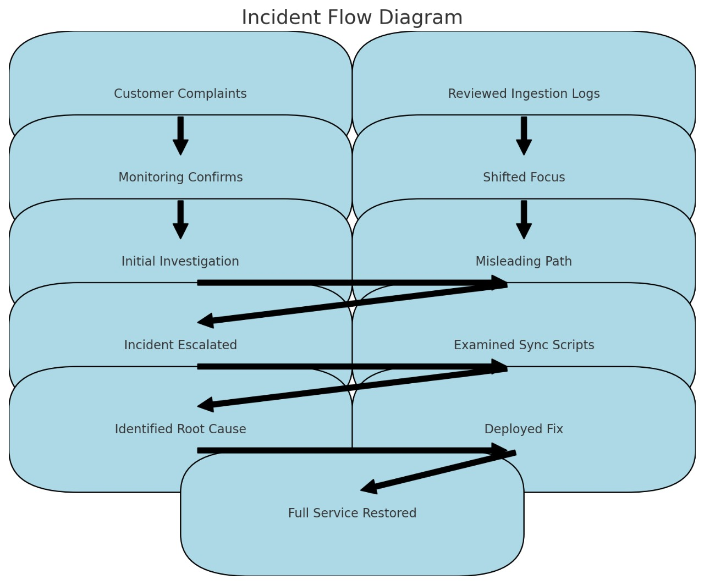

# Postmortem Report: Data Synchronization Outage

---

## Issue Summary

*Duration of Outage:* June 23, 2024, 09:00 UTC to June 23, 2024, 12:00 UTC

*Impact:* The analytics dashboard displayed inaccurate data, leading to significant discrepancies in user reports. Approximately 60% of users were affected, experiencing delayed or missing data points.

*Root Cause:* The root cause was an incorrect timestamp format in the data synchronization process between the main database and the analytics server, causing data mismatches and delays.

---

## Timeline

- *09:00 UTC:* Issue detected through customer complaints about inaccurate data on the analytics dashboard.
- *09:10 UTC:* Monitoring tools confirmed data discrepancies and synchronization delays.
- *09:20 UTC:* Initial investigation focused on the data ingestion process.
- *09:30 UTC:* Data ingestion logs reviewed, but no anomalies found; attention shifted to data synchronization operations.
- *09:45 UTC:* Network latency suspected as a potential cause, but network logs showed normal performance.
- *10:00 UTC:* Incident escalated to the database and analytics teams for further investigation.
- *10:30 UTC:* Detailed examination of the data synchronization scripts revealed a mismatch in timestamp formats.
- *11:00 UTC:* A recent update was identified as the source of the incorrect timestamp format.
- *11:30 UTC:* A fix was deployed to correct the timestamp format, and the data synchronization process was restarted.
- *12:00 UTC:* Full service was restored, and users were notified of the resolution.

---

## Root Cause and Resolution

*Root Cause:* The issue was caused by an incorrect timestamp format within the data synchronization process between the main database and the analytics server. Picture it as a librarian who decides to rearrange the library by random whims, causing utter chaos. This mix-up caused improper data syncing and delays, leading to inaccurate data on the analytics dashboard.

*Resolution:* The resolution involved identifying and correcting the timestamp format in the data synchronization scripts. Once the issue was pinpointed, the team deployed a fix to revert the timestamp format to its correct state. The data synchronization process was restarted, setting things right and restoring accurate data to the analytics dashboard.

---

## Corrective and Preventative Measures

*Improvements:*
1. *Code Review:* Enhance the code review process to include checks for format consistency, particularly in critical data operations.
2. *Automated Testing:* Implement automated tests to validate timestamp formats and other critical data fields before deployment.
3. *Monitoring Enhancements:* Strengthen monitoring to detect data discrepancies and synchronization issues more promptly.

*Task List:*
1. *Update Code Review Checklist:* Include specific checks for timestamp and data format consistency.
2. *Develop Automated Tests:* Create automated tests to verify timestamp formats and other essential data fields.
3. *Enhance Monitoring Tools:* Improve monitoring tools to alert the team about data discrepancies and synchronization delays.
4. *Conduct Training:* Train the team on best practices for data format handling and synchronization.
5. *Update Incident Response Plan:* Revise the incident response plan to include steps for quickly identifying and resolving data synchronization issues.

---

## Incident Flow Diagram

This visual representation helps clarify the sequence of events and the resolution process.

---

In the fast-paced world of data, even a small format error can cause big headaches. But with a keen eye, a solid plan, and a dedicated team, no data discrepancy is too great to overcome.
